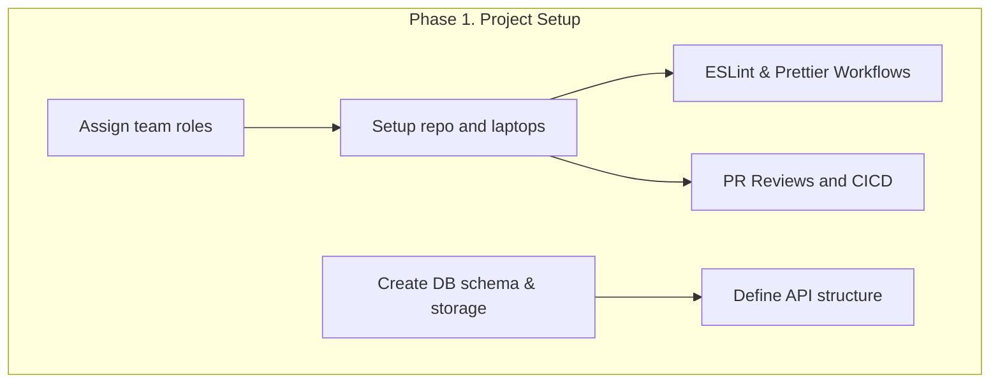

```mermaid
graph TD
subgraph A [Phase 1. Project Setup]
  A2[Assign team roles]
  A3[Setup repo and laptops]
  A4[ESLint & Prettier Workflows]
  A5[PR Reviews and CICD]
  A6[Create DB schema & storage]
  A7[Define API structure]
  A2 --> A3
  A3 --> A4
  A3 --> A5
  A6 --> A7
end

```