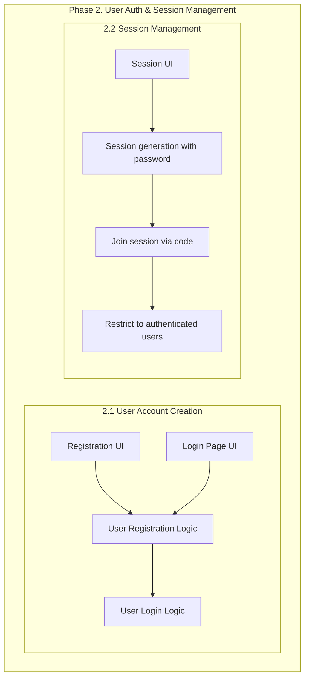

```mermaid
graph TD
subgraph B [Phase 2. User Auth & Session Management]
  subgraph B1 [2.1 User Account Creation]
    B1a[Registration UI]
    B1b[Login Page UI]
    B1c[User Registration Logic]
    B1d[User Login Logic]
    B1a --> B1c
    B1b --> B1c
    B1c --> B1d
  end
  subgraph B2 [2.2 Session Management]
    B2a[Session UI]
    B2b[Session generation with password]
    B2c[Join session via code]
    B2d[Restrict to authenticated users]
    B2a --> B2b --> B2c --> B2d

  end
end

```