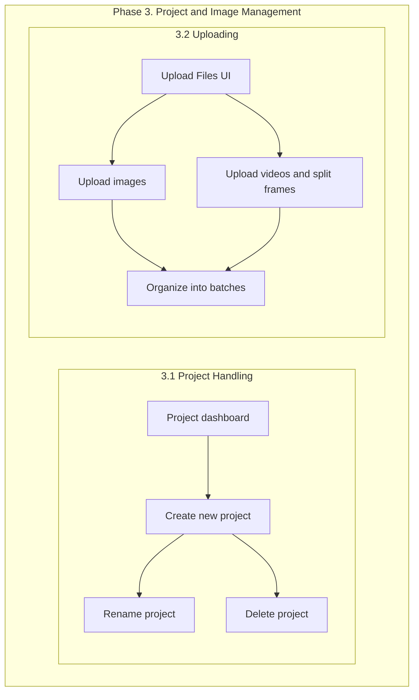

```mermaid
graph TD
subgraph C [Phase 3. Project and Image Management]
  subgraph C1 [3.1 Project Handling]
    C1a[Project dashboard]
    C1b[Create new project]
    C1c[Rename project]
    C1d[Delete project]
    C1a --> C1b
    C1b --> C1c
    C1b --> C1d
  end
  subgraph C2 [3.2 Uploading]
    C2e[Upload Files UI]
    C2a[Upload images]
    C2b[Upload videos and split frames]
    C2c[Organize into batches]
    C2e --> C2a
    C2e --> C2b
    C2a --> C2c
    C2b --> C2c
  end
end


```
