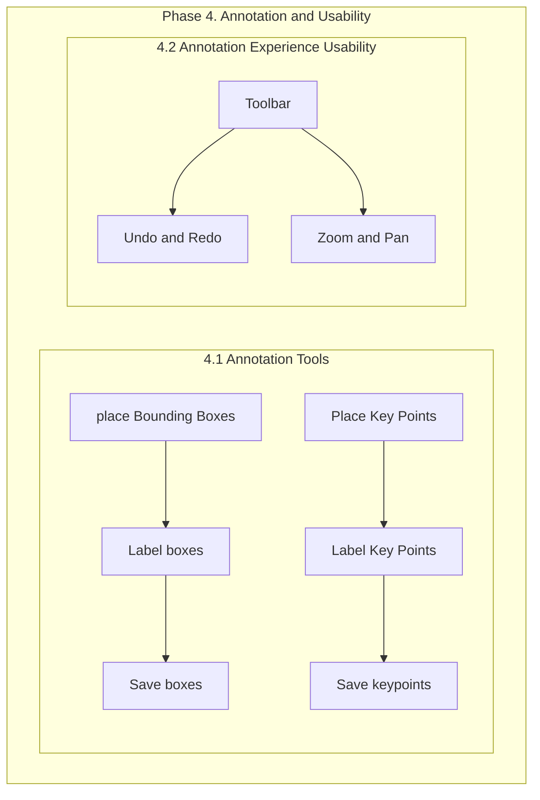

```mermaid
graph TD

subgraph D [Phase 4. Annotation and Usability]

  subgraph D1 [4.1 Annotation Tools]
  
    BB1[place Bounding Boxes]
    BB2[Label boxes]
    BB3[Save boxes]
    BB1 --> BB2 --> BB3

    KP1[Place Key Points]
    KP2[Label Key Points]
    KP3[Save keypoints]
    KP1 --> KP2 --> KP3
  end

  subgraph D2 [4.2 Annotation Experience Usability]
    E3[Toolbar]

    E1[Undo and Redo]
    E2[Zoom and Pan]

    E3 --> E1
    E3 --> E2
  end

end


```
