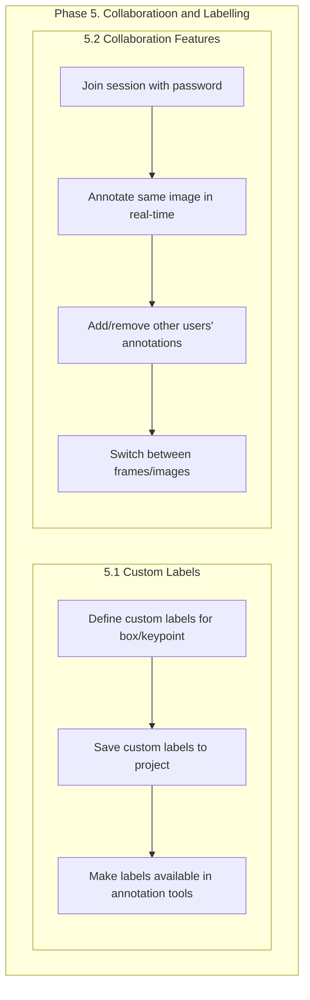

```mermaid
graph TD
subgraph D2 [Phase 5. Collaboratioon and Labelling]
  subgraph D3 [5.1 Custom Labels]
    CL1[Define custom labels for box/keypoint]
    CL2[Save custom labels to project]
    CL3[Make labels available in annotation tools]
    CL1 --> CL2 --> CL3
  end

  subgraph D4 [5.2 Collaboration Features]
    C1[Join session with password]
    C2[Annotate same image in real-time]
    C3[Add/remove other users' annotations]
    C4[Switch between frames/images]
    C1 --> C2 --> C3 --> C4
  end
end
```