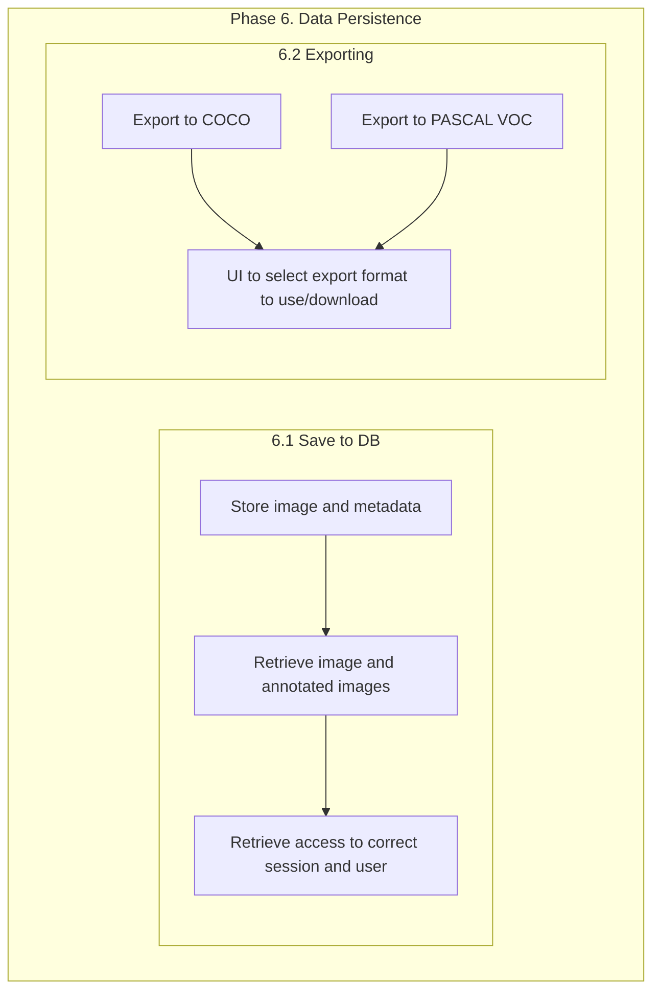

```mermaid
graph TD
subgraph F [Phase 6. Data Persistence]
  subgraph F1 [6.1 Save to DB]
    F1a[Store image and metadata]
    F1b[Retrieve image and annotated images]
    F1c[Retrieve access to correct session and user]
    F1a --> F1b --> F1c
  end
  subgraph F2 [6.2 Exporting]
    F2a[Export to COCO]
    F2b[Export to PASCAL VOC]
    F2c[UI to select export format to use/download]
    F2a --> F2c
    F2b --> F2c
  end
end
```