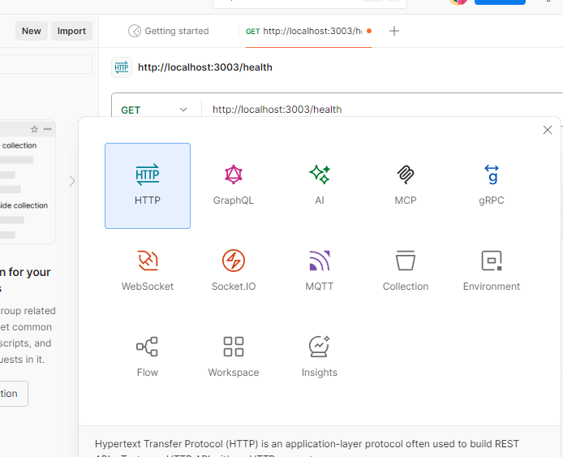
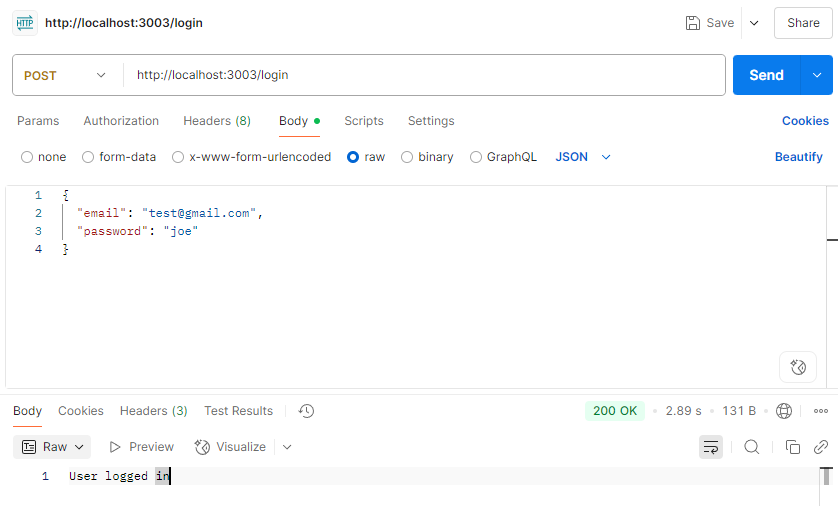

## Authenticating to Google Cloud

everyday you'll need to begin your development by logging into to Google Cloud so you can access the GCP project. this involves running the command
`gcloud auth application-default login`

Once logged in you should be able to use services on gcloud from your local

## Using Postman

if you want to test sending requests to your api's with input parameters, your best bet is using Postman.

[Download Postman here](https://www.postman.com/downloads/)

After downloading, opening and logging in, press new at the top and select HTTP



you can now write your URL that you want to send a request to, like `localhost:3003/login`,

If you want to include login info, you can go body > raw > then enter the json of your choice

```
{
  "email": "test@gmail.com",
  "password": "joe"
}
```



We can see that if we sent, the API successfully handles the request and logs us in

This can be used similarly for any other requests that you would like to test
