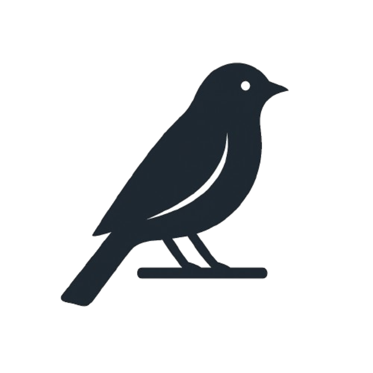

  

# FIT3162-Canary

Canary is a Web Based Cloud Native application designed for the uploading, storing, annotation, and exporting of Bird images and videos, for the purpose of training machine learning models. This software was developed as part of FIT3161 and FIT3162 Computer Science Project

Canary is deployed and ready to use from this url!
https://canary-frontend-277166024460.australia-southeast1.run.app/home

# Architecture

Canary utilises a microservice architecture, in which core processes are developed and deployed independently, in order to maintain a level of separation between core services, and improve scalability. The purpose of which is to ensure that development can remain isolated, with new features developed without the worry of impacting existing services.

# Requirement Traceability Matrix

The following RTM was used as a benchmark for what features needed to be developed within the application.

| Req. ID | Description                                                                                                                                                                                                                                                          | Categories     | Type | Source                                                                                                                               | Status |
| ------: | -------------------------------------------------------------------------------------------------------------------------------------------------------------------------------------------------------------------------------------------------------------------- | -------------- | ---- | ------------------------------------------------------------------------------------------------------------------------------------ | ------ |
|       1 | Bounding Box Annotation on bird images (rectangles by 2 points: top right & bottom left) with labels. Keypoint Annotation for features: Beak, Tip of Wing, Foot joint, Knee Joint, Eye.                                                                           | Annotation     | FR   | Existing Solution: [roboflow.com](https://roboflow.com/) Documents: Business Case & Mind Map reports Person: Client (ML space) | Done   |
|       2 | Upload image/video saved as a batch in project; click batch to annotate all images. If video: split into frames for individual annotation. Annotating frame X persists annotations to X+1 for easy adjustment.                                                 | Uploading      | FR   | Existing Solution: [roboflow.com](https://roboflow.com/) Documents: Business Case & Mind Map reports                              | Done   |
|       3 | Export final annotated images to common formats: COCO, PASCAL VOC.                                                                                                                                                                                                   | Saving         | FR   | Additional Info: types of image annotation formats Person: Client (ML space)                                                      | Done   |
|       4 | Multi-user session to annotate same batch simultaneously. Place/edit/remove own or others’ annotations. Owner can set session password. Session contains multiple images from a chosen batch.                                                               | Scalability    | NFR  | Documents: FIT3161 Software Project List; Business Case & Mind Map reports Person: Client                                         | Done   |
|       5 | Per-user undo for create/edit/delete (not others’ actions). Zooming for fine-grained positioning.                                                                                                                                                                 | Usability      | NFR  | Additional Info: Multi-user undo                                                                                                     | Done   |
|       6 | Users must register/login; auth required on each page or redirect to login. Joining a session requires simple account (Username, Password).                                                                                                                       | Authentication | NFR  | Additional Info: Account Creation Basics User Auth                                                                                | Done   |
|       7 | All uploaded images & annotations stored in a database for later retrieval (not local).                                                                                                                                                                              | Database       | FR   | Additional Info: GCP Buckets                                                                                                         | Done   |
|       8 | UI pages: Login/Signup; Home (single user, multi-user session, view saved); Projects list; Project detail (uploading, properties, dataset export formats); Image viewer with annotations/controls; Annotation controls sidebar with auto-loading images/annotations. | UI/UX          | NFR  | Existing Solution: Roboflow                                                                                                          | Done   |

# Software Screenshots

### Home Page

### Project Page

### Annotation Page

